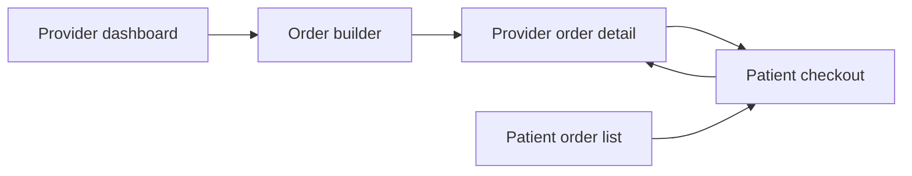
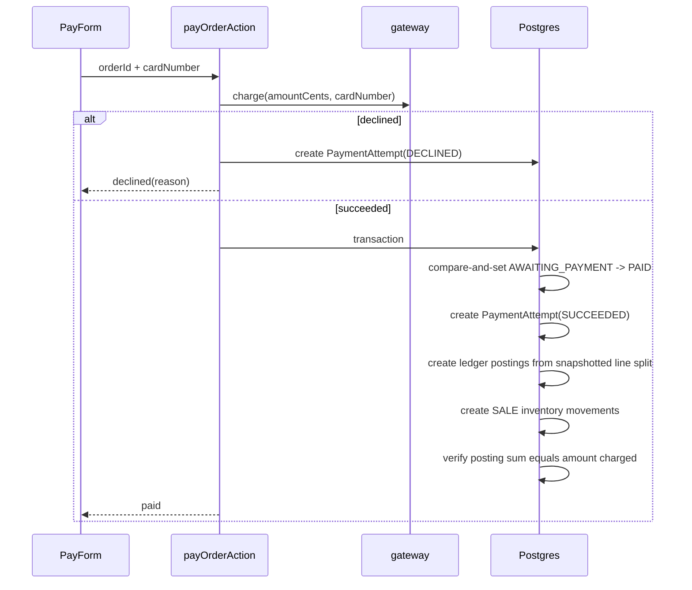

# Cerbo Formulary Architecture

## What This Is

Cerbo Formulary is a vertical slice for provider-managed in-house supplement
orders. The slice proves the core workflow:

1. A provider builds an order from a catalog with live fee and margin preview.
2. A patient pays through a stubbed checkout.
3. Successful payment atomically writes the payment attempt, ledger postings,
   inventory sale movement, and paid status.
4. The provider can audit where every cent went.

This is not a general marketplace, auth system, warehouse system, or real
payment processor integration. Those are production expansion points. The
slice is intentionally narrow so the money invariant, payment retry behavior,
and provider/patient handoff are easy to inspect.

## Design Standard

The local benchmark projects establish the bar this scaffold should meet:

- **Bellwether:** deterministic scoring, routing, guardrails, and dispatch seams;
  model-like judgment is isolated from hard invariants.
- **Future Knowledge Graph:** the graph owns reasoning and safety; the LLM owns
  language. Critical constraints remain mechanically enforceable.
- **Panini:** architectural choices are documented as trade-offs, not just code
  that happens to exist.
- **Tessera:** the UI is an interaction model with explicit state, phases, and
  feedback rules, not a pile of screens.

Cerbo's equivalent stance: integer money math and database transactions own the
business truth. UI state previews the truth but never becomes the source of it.
The fake gateway only supplies charge outcomes; it does not decide splits,
ledger shape, inventory movement, or idempotency.

## Product Surfaces



- `src/app/provider/page.tsx`: operating dashboard for catalog, sales, inventory,
  recent orders, and executive impact metrics.
- `src/app/provider/orders/new/OrderBuilder.tsx`: client-side order assembly and
  live preview. The preview uses the same pure money helpers as the backend.
- `src/app/provider/orders/[id]/page.tsx`: audit surface for snapshotted lines,
  payment attempts, ledger postings, and the exact-posting badge.
- `src/app/patient/page.tsx`: patient-facing list of pending and paid orders.
- `src/app/pay/[orderId]/page.tsx` and `PayForm.tsx`: checkout surface with
  demo success/decline cards.

## Money Model

All money is integer cents. Floats do not enter the model.

Per line:

```text
lineTotal = unitPriceCents * quantity
cogs      = unitCogsCents * quantity
fee       = round_half_up(lineTotal * 75 / 10000)
margin    = lineTotal - cogs - fee
```

The invariant is enforced in `src/lib/money.ts`:

```text
cogsCents + feeCents + marginCents == totalCents
```

The provider can edit patient-facing prices, but the backend recomputes the
split before any order is created. Negative margin is rejected before persistence.

## Persistence Model

Prisma models live in `prisma/schema.prisma`.

- `Supplement` is the mutable catalog.
- `OrderLine` snapshots catalog COGS and provider-entered price at order time.
- `Order` stores order-level rollups for display; per-line split columns remain
  the source for payment-time ledger postings.
- `PaymentAttempt` records both declines and successes.
- `LedgerPosting` is written only after successful payment.
- `InventoryMovement` is an append-only movement log; stock on hand is the sum of
  deltas.

The important production-shaped choice is snapshotting. Later catalog edits must
not change the economics of an order already placed.

## Payment Flow

`src/lib/orders.ts` owns the payment transaction.



Guarantees:

- A declined card records an attempt and writes no ledger or inventory movement.
- A paid order has one successful attempt, complete ledger postings, and sale
  movements in the same transaction.
- Replay and double-clicks are idempotent through an atomic status update.
- Ledger postings are generated from persisted line splits, not current catalog
  values and not client state.

## UI System

The UI follows Cerbo's public brand direction without turning the tool into a
marketing page:

- Editorial serif headings paired with Inter/system body text.
- Cerbo blue for primary actions, navy/gray for operating surfaces, and logo
  accent colors for scan markers.
- Dense tables for repeated provider work.
- 8px cards for real repeated items and framed tools only.
- "Designed by Thalia" is part of the product frame.

Iconography rules:

- Use familiar `lucide-react` symbols beside text for primary commands.
- Keep labels visible for high-frequency actions; icon-only controls are avoided
  unless the symbol is universal and the control has an accessible label.
- Navigation and payment actions use consistent icon families:
  dashboard, package-plus, refresh, credit-card, copy/check, plus, send,
  success, and decline.
- Icons are decorative when paired with text (`aria-hidden="true"`) so accessible
  names remain stable and readable.

## Verification

Current gates:

```bash
npm run test
npm run build
BASE_URL=http://127.0.0.1:3002 npm run e2e
```

Coverage:

- Pure money math: integer cents, fee rounding, exact split sum, below-cost
  rejection, target-margin gross-up.
- Integration: order creation, declined payment, successful payment, replay
  idempotency, concurrent double-pay, ledger sum, inventory movement.
- Browser e2e: dashboard catalog, live split preview, happy payment path,
  declined card, declined-then-success retry, patient view, restock.

## Trade-Offs And Expansion Points

| Choice | Why | Expansion path |
| --- | --- | --- |
| Stubbed payment gateway | The PRD allows a fake processor and the slice needs deterministic success/decline demos. | Replace `gateway` with Stripe PaymentIntents plus webhook reconciliation while preserving `payOrder` invariants. |
| Cookie role switch | Auth is out of scope, but provider/patient handoff must be demoable. | Replace `ROLE_COOKIE` with real sessions and role-bound database queries. |
| Static patient roster | Keeps the order flow focused on money and inventory. | Add `Patient` model and provider-patient ownership checks. |
| Catalog-managed stock | Enough to prove sale and restock movements. | Add receiving, adjustments, low-stock thresholds, lot/expiration if required. |
| Provider-entered patient price | Demonstrates margin preview and exact split. | Add target-margin mode using `priceForTargetMargin`. |

## Known Gaps Before Production

- Real payment processor, webhooks, refunds, disputes, and payout reconciliation.
- Authorization around provider ownership of orders, patients, and catalog items.
- Database constraints for at-most-one successful payment at the schema level.
- Admin workflows for catalog edits, inactive supplements, and inventory audits.
- Accessibility pass with keyboard-only walkthrough and screen-reader spot checks.
- Visual regression snapshots once the brand direction settles.
